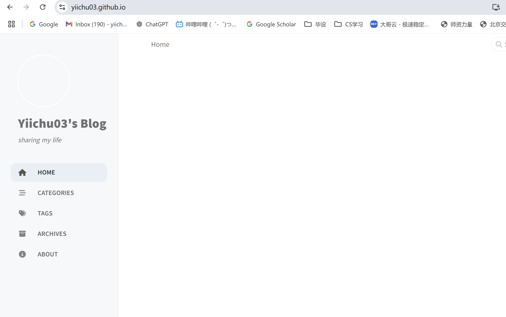

用这个来记录我的菜鸟学习过程——之想要创建github.io

# 参考教程网址

https://blog.csdn.net/zzy979481894/article/details/132678717

https://chirpy.cotes.page/posts/getting-started/

https://docs.github.com/zh/pages/setting-up-a-github-pages-site-with-jekyll/creating-a-github-pages-site-with-jekyll

# 进度

已经有了雏形，我准备晚上整理一下这次流程，之后再学习怎么上传文章hhh

