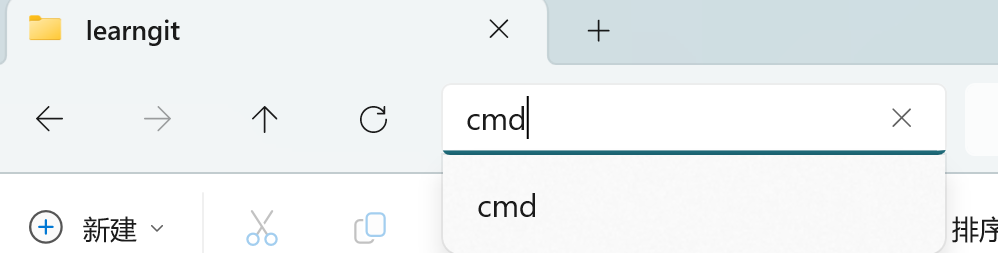

用这个来记录我学习去参加Kaggle的过程。

# Table of Contents

- [git](#git)
- [prepare for Kaggle](#prepare-for-kaggle)
  * [jupyter notebook](#jupyter-notebook)
  * [markdown toc](#markdown-toc)

# git

```
git init
git clone https://github.com/username/repository-name.git
git config --global user.name "Your Name"
git config --global user.email "your-email@example.com"
```

然后我使用了Tortoisegit. 不过之后还是要多熟悉命令行git的使用。

# prepare for Kaggle

检查了一下我的`anaconda`环境，有一个之前创建的`pytorch`环境，还有一个没用的环境（现在已经删除了），准备先用着。然后我现在电脑里没有`jupyter notebook`，等下安装一个。

```
conda env list
conda env remove --name envname
```

## jupyter notebook

直接在命令行安装就行

```
pip3 install jupyter
```

使用的时候，在想使用的那个路径框中输入`cmd`然后命令行输入`jupyter notebook`就可以。



使用`start.ipynb`回忆了一下`jupyter notebook`的使用

## markdown toc

typora的[TOC]在github上不显示目录，所以去搜了一下。

用下面这个网址或者手打都行

```
- [Table of Contents](#table-of-contents)
- [git](#git)
- [prepare for Kaggle](#prepare-for-kaggle)
  * [jupyter notebook](#jupyter-notebook)
  * [markdown toc](#markdown-toc)
```

https://ecotrust-canada.github.io/markdown-toc/


# start Kaggle with titanic

https://www.kaggle.com/competitions/titanic

首先如上是比赛页面

然后里面有指导

```markdown
Recommended Tutorial
We highly recommend **Alexis Cook’s Titanic Tutorial**(**https://www.kaggle.com/code/alexisbcook/titanic-tutorial**) that walks you through making your very first submission step by step and this **starter notebook**（**https://www.kaggle.com/code/gusthema/titanic-competition-w-tensorflow-decision-forests**） to get started.
```

https://www.kaggle.com/code/alexisbcook/titanic-tutorial

https://www.kaggle.com/code/gusthema/titanic-competition-w-tensorflow-decision-forests


有一个推荐的学习教程：https://www.kaggle.com/learn/intro-to-programming

https://www.kaggle.com/learn/python

感觉这个说builds on 和 preparation的设计还挺友好的


